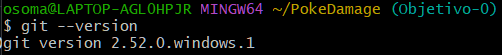
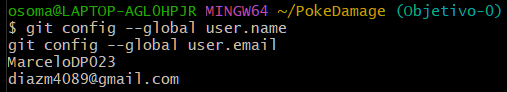
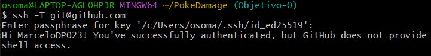
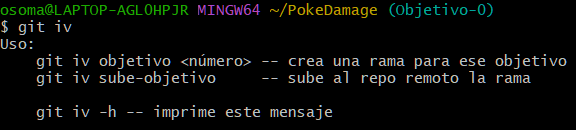

# Configuración GIT

## Instalación de Git

Debido a que GIT ya lo tenía descargado en mi ordenador, 
simplemente con git --version confirmamos que lo tengo
descargado.

## Identidad de Git

Aquí como ya lo tenía configurado también con mi correo y
nickname de GIT pues no he tenido que hacer anda en especial.

## Conexión SSH con GitHub

Luego si he configurado la conexión ssh con GIT haciendo uso
de clave asimétrica, generando una clave pública y privada, conectando
mi ordenador de trabajo a GIT.

## Instalación de git iv

Para la instalación de la extensión creada por el profesor, descargue el script
la añadí al path de /bin (para usar este desde cualquier repo) y añadi una línea en el archivo 
donde debía especificar donde se encontraba la librería de perl, ya que me daba un error.

