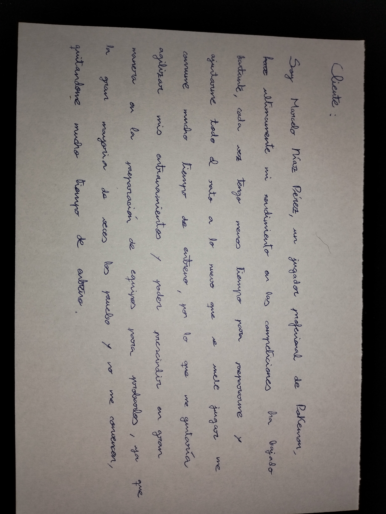
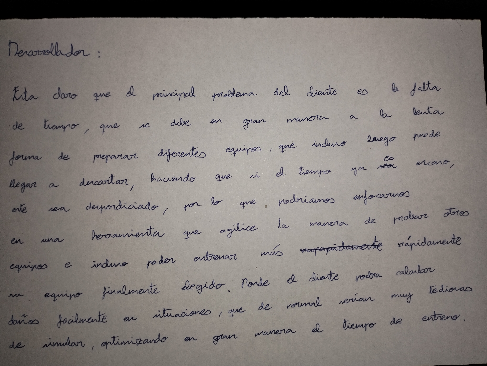

# PokeDamage

## Cartas del juego de rol (Hecho en clase, pasado a limpio en casa)

## Descripción del Problema

El cliente Marcelo Díaz Pérez, jugador profesional de Pokémon, entrena de forma poco
óptima para sus torneos, haciendo que no consiga el rendimiento que el esperaría tener, lo
que puede hacer peligrar su carrera. 

Este juego se basa en un combate por turnos, donde combaten equipos de 6 Pokemon (De los que se eligen 4 antes de empezar
el combate) en los que solo puede haber 2 en combate,(por lo que tratamos situaciones de 2 vs 2) donde se busca debilitar 
a todos los pokemon del rival, obviamente sin que debiliten a los tuyos. Los Pokemon poseen estadísticas (Ataque Físico, 
Ataque Especial, Defensa Física, Defensa Especial y Velocidad), las estadísticas de ataque determinarán la potencia final de un 
ataque de esa categoría, las defensas la mitigación de daño que tendrá contra esa categoría de ataque y la velocidad determina quien 
ataca primero en el turno. Estos Pokemon poseen Tipos (también los movimientos) que poseen ventajas y desventajas entre ellos, un movimiento de un tipo
que posea ventaja frente al tipo del Pokemon en contra le hará el doble de daño y si posee desventaja le hará la mitad.
Luego estos Pokemon poseen habilidades que pueden tener diferentes efectos en combate, como aumentos de daños, pasivas, etc...
aunque las importantes aquí son las que afectan directamente al daño que pueden llegar a inflingir. En los combates hay 
Climas que alteran las estadísticas y daños de ciertos tipos de movimientos, dependiendo del clima. Y por último se puede
realizar un aumento de las estadísticas de los Pokemon con unos puntos denominados EVs, los cuales solo pueden aumentar se
distribuyen en 66 puntos que se pueden repartir a gusto del jugador.

En este tus Pokemon pueden utilizar diferentes movimientos (Solo pueden aprender 4, y deben ser movimientos capaces de aprender por este mismo ) y pueden configurarse de diferentes maneras, modificando sus estadísticas, habilidades y otros parámetros. Además de tener que contar con la configuración 
que puede llevar nuestro rival y condiciones ajenas a las configuraciones de los Pokemon que afectan al combate. 
Esto genera un grán abanico de posibilidades que llegan a ser prácticamente imposibles de probar todas, debido a las extensas modificaciones que se
pueden a hacer a un Pokemon, a las sinergias que pueden tener entre ellos y a la gran variedad de estos (Actualmente hay unos 1025 Pokemon).

Marcelo para poder probar estas combinaciones, debe de probarlas manualmente y ver como estos se pueden 
llegar a comportar contra los posibles equipos enemigos, este proceso conlleva una grán cantidad de tiempo,
que incluso puede llegar a desperdiciarse por completo si ese equipo que ha querido comprobar no le convence. 
Con el añadido de que preparar un equipo es una tarea tediosa.

El problema consiste en reducir el tiempo necesario para analizar las distintas combinaciones de equipos y 
incluso hacer del entrenamiento algo mas ágil y cómodo añadiendo un refuerzo positivo a este. Ya que sería
mucho más fácil simular situaciones de combate que puedan llegar a pasar, en vez de jugar partidas como loco, gastando 
una grán cantidad de tiempo e incluso llegando a ni si quiera ver todas las diferentes situaciones.

Por lo que para realizar este trabajo se deberá trabajar con las estadísticas de los Pokemon, sus posibles
movimientos, habilidades, tipos y condiciones externas (EVs, climas,...)

## Configuración de GIT

[Configuración](Configuracion/configuracion.md)

## Datos

[Obtención de los Datos](Datos/datos.md)

