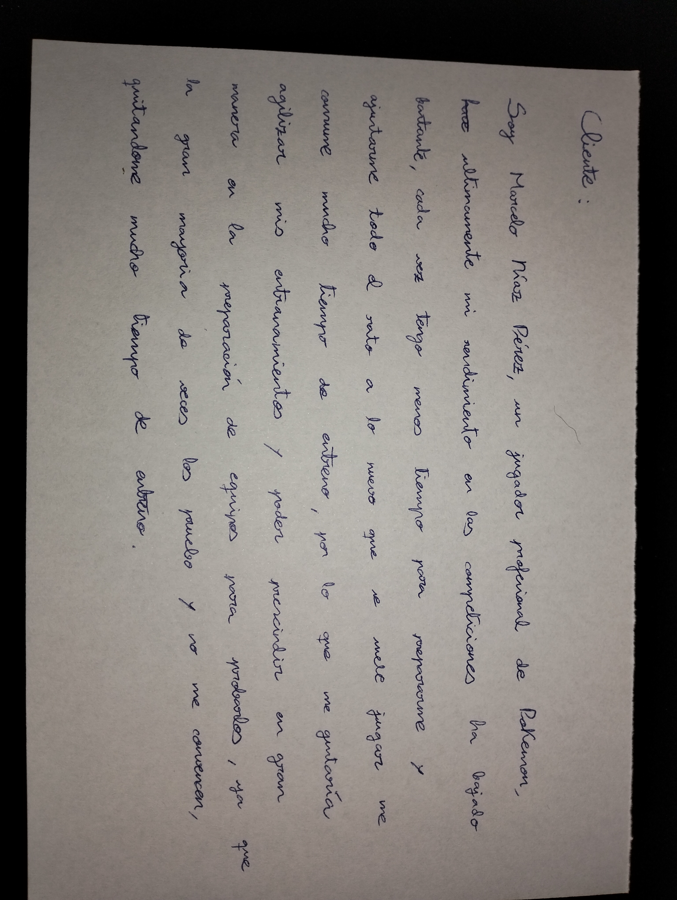
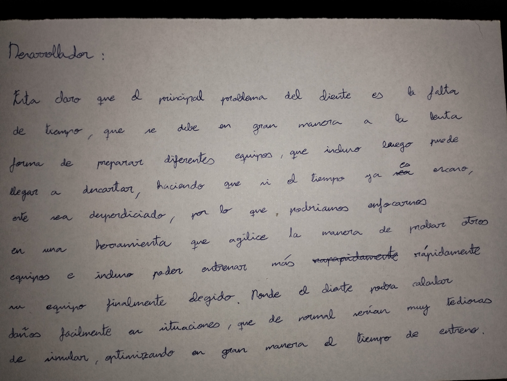

# PokeDamage

## Cartas del juego de rol (Hecho en clase, pasado a limpio en casa)

## Descripción del problema

Marcelo Díaz Pérez participa en competiciones de Pokémon y dedica parte de su
entrenamiento a preparar su equipo y practicar cómo responder ante diferentes
situaciones que pueden aparecer durante un combate.

En una partida, cada jugador utiliza un equipo de Pokémon. Cada Pokémon tiene
unas estadísticas, uno o dos tipos, una habilidad y un conjunto limitado de
movimientos. Además, el jugador puede modificar parte de sus estadísticas
mediante los EVs y existen condiciones del combate, como el clima, que pueden
modificar el daño producido.

Todo esto hace que una misma acción pueda tener resultados diferentes dependiendo
de la configuración del Pokémon atacante, la del defensor, el movimiento elegido
y las condiciones presentes en ese momento.

La preparación de un equipo no consiste únicamente en elegir qué Pokémon utilizar.
También es necesario comprobar si determinadas configuraciones permiten responder
correctamente ante situaciones que el jugador considera importantes. Por ejemplo,
puede necesitar saber si un movimiento de menor potencia pero mayor precisión es
suficiente para debilitar a un rival, o si necesariamente debe utilizar otro más
potente pero con riesgo de fallar.

Actualmente, muchas de estas situaciones se comprueban jugando partidas de
entrenamiento. El problema es que una partida real no permite controlar qué
situaciones van a aparecer. Para estudiar un caso concreto puede ser necesario
jugar muchas partidas hasta encontrar unas condiciones similares, y algunas
situaciones poco frecuentes pueden no aparecer durante el entrenamiento y sí
hacerlo posteriormente en un torneo.

Además, antes de utilizar una configuración es necesario invertir tiempo en
prepararla. Si después de probarla el jugador descubre que no responde bien a las
situaciones que quería cubrir, parte de ese tiempo de preparación se ha empleado
en una configuración que finalmente será descartada.

Por tanto, el problema consiste en facilitar el análisis previo de situaciones
concretas de combate para reducir el tiempo empleado en preparar y comprobar
configuraciones y permitir que el entrenamiento se centre en aquellas decisiones
que realmente necesitan ser practicadas.

No se pretende analizar automáticamente todas las combinaciones posibles del
juego, sino permitir estudiar casos concretos que el propio jugador considere
relevantes para la preparación de un torneo.

### Lógica de negocio prevista

Para analizar una situación será necesario combinar información del Pokémon
atacante, del defensor y del estado del combate.

A partir de sus estadísticas base y de su configuración se deberán obtener las
estadísticas efectivas de ambos Pokémon. Después habrá que determinar qué
estadísticas intervienen según el movimiento utilizado y aplicar los distintos
modificadores que afectan al daño, entre ellos la potencia y categoría del
movimiento, los tipos del atacante y del defensor, la efectividad entre tipos,
las habilidades, la naturaleza, los EVs y determinadas condiciones del combate.

El daño tampoco es un valor completamente fijo, ya que incluye una variación
aleatoria. Por ello, para una situación concreta no bastará con obtener un único
valor, sino que se podrá calcular el rango de daño posible y determinar en qué
casos ese daño sería suficiente para debilitar al adversario.

Esta lógica permitirá comparar varias decisiones dentro de una misma situación,
por ejemplo dos movimientos posibles, sin necesidad de simular un combate
completo ni recorrer todas las combinaciones existentes en el juego.

## Planificación

La planificación inicial del proyecto se ha realizado a partir del recorrido del
usuario, las historias de usuario y una serie de productos mínimamente viables
organizados en milestones.

- [User Journey](docs/User_Journey.md)
- [Historias de usuario](https://github.com/MarceloDP023/PokeDamage/issues?q=is%3Aissue%20label%3Auser-stories)
- [Milestones](https://github.com/MarceloDP023/PokeDamage/milestones)

## Configuración de GIT

[Configuración](Configuracion/configuracion.md)

## Datos

[Obtención de los Datos](Datos/datos.md)

